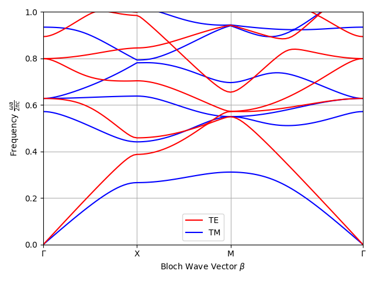
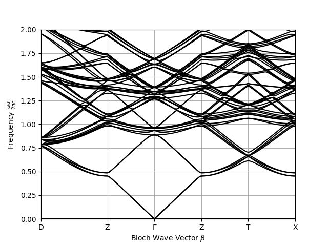

|PyPI License| |PyPI PyVersions| |PyPI Version| |Build Status| |DeepSource| |Codecov| |Documentation Status|

================
 PWE Framework for 3D/2D/1D Photonic Crystal Analysis
================

Quick examples:
##############

.. code-block:: python

  """2D example."""
  from morpho import BrillouinZonePath as BZPath
  from morpho import Geometry, Solver2D
  from morpho import SymmetryPoint as SPoint

  Nx, Ny = 64, 64
  P, Q = 5, 5
  a = 1
  eps_r = 9.8
  mu_r = 1.0

  # Define the symmetry points
  G = SPoint((0, 0), "Γ")
  X = SPoint((1 / 2, 0), "X")
  M = SPoint((1 / 2, 1 / 2), "M")

  t1, t2, t3 = (a, 0, 0), (0, a, 0), (0, 0, a)

  # Construct the bloch wave path
  bz_path = BZPath([G, X, M, G], t1, t2, n_points=100)

  # Construct the geometry
  geo = Geometry(t1, t2, None, Nx, Ny, 1)

  # Define the permitivity profile
  @geo.set_epsr_f
  def epsr_f():
      """Define eps_r profile function."""
      mask = geo.x**2 + geo.y**2 <= 0.2**2
      geo.eps_r[mask] = eps_r

  # Define the permeability profile
  @geo.set_mur_f
  def mur_f():
      """Define mu_r profile function."""

  # Solve
  solver_tm = Solver2D(geometry=geo, path=bz_path, P=P, Q=Q, pol="TM")
  solver_tm.run()

  solver_te = Solver2D(geometry=geo, path=bz_path, P=P, Q=Q, pol="TE")
  solver_te.run()

Results:
**********

.. code-block:: python

  """3D example."""
  from pwe import BrillouinZonePath as BZPath
  from pwe import Geometry, Solver
  from pwe import SymmetryPoint as SPoint

  Nx, Ny, Nz = 128, 128, 128
  P, Q, R = 3, 3, 3

  a = 1
  w = 0.2 * a
  eps_r = 2.34
  mu_r = 1.0

  # Define the symmetry points
  G = SPoint((0, 0, 0), "Γ")
  Z = SPoint((0, 0, 1 / 2), "Z")
  X = SPoint((1 / 2, 0, 0), "X")
  D = SPoint((1 / 2, 1 / 2, 1 / 2), "D")
  T = SPoint((1 / 2, 0, 1 / 2), "T")

  t1, t2, t3 = (a, 0, 0), (0, a, 0), (0, 0, a)

  # Construct the bloch wave path
  bz_path = BZPath([D, Z, G, Z, T, X], t1, t2, t3, 200)

  # Construct the geometry
  geo = Geometry(t1, t2, t3, Nx, Ny, Nz)

  # Define the permitivity profile
  @geo.set_epsr_f
  def epsr_f():
      """Define eps_r profile function."""
      mask1 = (abs(geo.x) >= a/2 - w/2) & (abs(geo.y) >= a/2 - w/2)
      mask2 = (abs(geo.x) >= a/2 - w/2) & (abs(geo.z) >= a/2 - w/2)
      mask3 = (abs(geo.y) >= a/2 - w/2) & (abs(geo.z) >= a/2 - w/2)
      geo.eps_r[mask1 | mask2 | mask3] = eps_r

  # Define the permeability profile
  @geo.set_mur_f
  def mur_f():
      """Define mu_r profile function."""

  # Solve
  solver = Solver(geometry=geo, path=bz_path, P=P, Q=Q, R=R)
  solver.run()

Results:
**********

References:
###########
[1] J. D. Joannopoulos, Ed., Photonic crystals: molding the flow of light, 2nd ed. Princeton: Princeton University Press, 2008.

 

.. |PyPI License| image:: https://img.shields.io/pypi/l/morpho.py.svg
  :target: https://pypi.python.org/pypi/morpho.py

.. |PyPI PyVersions| image:: https://img.shields.io/pypi/pyversions/morpho.py.svg
  :target: https://pypi.python.org/pypi/morpho.py

.. |PyPI Version| image:: https://img.shields.io/pypi/v/morpho.py.svg
  :target: https://pypi.python.org/pypi/morpho.py

.. |Build Status| image:: https://travis-ci.com/tiagovla/morpho.py.svg?branch=master
  :target: https://travis-ci.com/tiagovla/morpho.py

.. |DeepSource| image:: https://deepsource.io/gh/tiagovla/morpho.py.svg/?label=active+issues
  :target: https://deepsource.io/gh/tiagovla/morpho.py/?ref=repository-badge

.. |Codecov| image:: https://codecov.io/gh/tiagovla/morpho.py/branch/master/graph/badge.svg?token=QR1RMTPX0H
  :target: https://codecov.io/gh/tiagovla/morpho.py

.. |Documentation Status| image:: https://readthedocs.org/projects/morpho-py/badge/?version=latest
  :target: https://morpho-py.readthedocs.io/en/latest/?badge=latest
